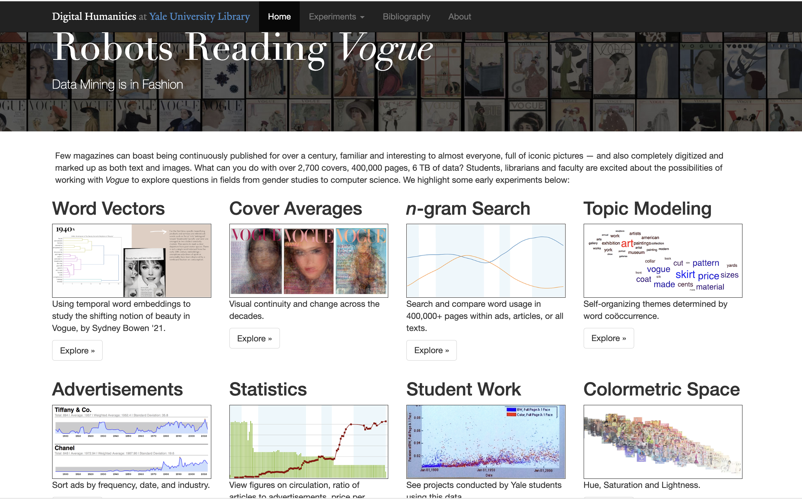
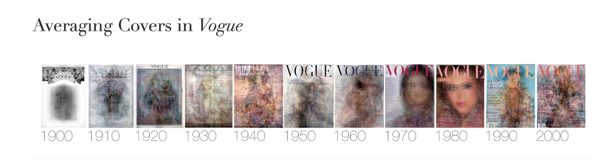

## Source

[Robots Reading Vogue. Yale University Library, Digital Humanities Labotories](https://dhlab.yale.edu/projects/vogue/)

## Evaluation
Robots Reading Vogue is a data mining project in fashion. This project analyzes trends in advertising, word usage, magazine cover art, and others in Vogue magazine from 1892 to the present day. This project involved various types of research. Topics of the project include Word Vectors, Cover Averages, n-gram Search Topic Modeling, Advertisements, Statistics, Student Work, Colorimetric Space, Fabric Space, Take a Memo, and Slice Histograms. This project is promoted by professors Linday and Peter Leonard from Yale University.  

This project provides insight into the trends in the previous Vogue magazines, which incorporates over 2,700 covers, 400,000 pages, and 6 TB of data. By analyzing fashion magazines at different periods, we can also acquire information related to lifestyle and printout publications during specific periods. My favorite project is the average cover project, which finds the average vogue magazine cover over every decade. In this project, scholars overlaped all covers in one decade and increased their transparency to get the an average cover image. In this study, we can see the change in the trend of the cover image, and this trend might be related to the different photographers or the stylistic change. From 1970 to 1980, the average cover image is almost the same person. It is important to mention that this project is not done by any algorithmic machine learning skill but rather by overlapping. 

### What else? ###
I think people can go deeper into this project to study the change in covers' color choices . I think there is an increased variation in the color usage due to technolgy improvements, and I am curious about the general color trend preference. Maybe it is possible to run machine learning algorithm and clustering methods to study the cover color question mentioned above.

### Strengths of the project ### 
This project has a large dataset, which provides researchers with abundant information to conduct their research. In each research, the dataset types and methodology are explained clearly and in detail. For example, in some machine learning studies, this project even included detailed explanations on their parsing method. The final visualization is also interesting and clear in terms of expressing the idea behind the research. Each small project is interesting and inspiring.  

### Weakness of the project ###
However, I found their website hard to navigate. Some pages are shown to be not found, or it is hard to navigate to some important documents and resources used in the research.  I would recommend maintaining their website better, and the webpage could be more interactive to readers.  