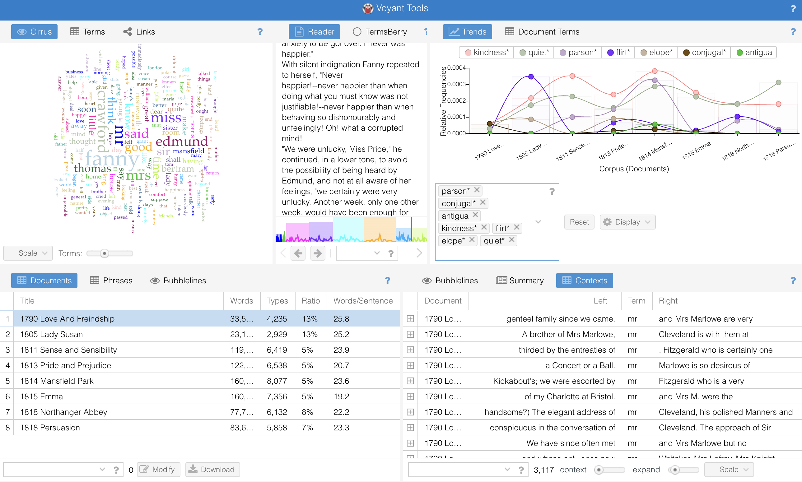

## Source

[Voyant Tools. Stéfan & Geoffery Rockwell. v. 2.6.0.](https://voyant-tools.org)

## Evaluation
Voyant Tool is a web-based open-source project for performing text analysis. This tool was developed by Stéfan Sinclair from McGill and Geoffrey Rockwell from the University of Alberta. It has a large international user base. Voyant's main server had 81,686 page views originating from 156 countries in October 2016 alone. Its features, such as word frequency lists and frequency distribution plots, promote reading and literature analysis.  

On its web-based application page, there are five different working panels with various analysis tools. Users can customize each panel with the specific functionality they need. Basic analysis tools include Cirrus (similar to Word Cloud), Terms (term frequency table), Looms (Link charts among selected words), and Trends (the word frequency chart depending on the section of the text). From the Context function, you may select keywords that you want to review, then this panel will show you words that are on the right or the left side of the keywords whenever it has been used. The summary function also provides analytical information related to words counts statistics from the input text.   

The graph below demonstrates different text analysis tools in Voyant-Tools. The imported text I used was a selection of Jane Austen’s novels, which includes *Love and Friendship*, *Lady Susan*, *Sense and Sensibility*, *Pride and Prejudice*, *Mansfield Park*, *Emma*, *Northanger Anney*, *Persuasion*. The Cirrus panel is the word cloud for *Mansfield Park*.  The trend panel shows how the frequency of “kindness”, “quiet”, “parson”, “flirt”, “elope”, “conjugal”, and “Antigua” changed across Austen’s different novels. 

Voyant tools make studies in digital humanities more efficient. For example, the Context function gives scholars the opportunity to compare how one specific word has been used under various contexts. And it is more efficient and direct than the typical method for searching the key word in the entire document. Besides that, the trend function allows scholars to directly compare the change of frequency of one word from one text to another chronologically while providing us insight into historical movements. For example, only Mansfield Park mentioned Antigua because Tom, a character in the book, went to Antigua, and this change could be related to colonialism. We can also apply Voyant on other text by simply uploading text files to Voyant. An interesting question might be using Voyant to study the book *Moby Dick*. We can use Voyant to find the frequency count of the word "revenge" and other most frequent words in the look and see how those most frequent words relate to the theme. 

Voyant tool provides a more simple and intuitive research method for humanities scholars with new research tools. This application is also easy to use and does not require any prior knowledge about coding or computer science. However, there are some flaws in this application, and it can be improved. For example, since sometimes it is confusing because after you make changes in the literature scope or the key words, those changes might not be immediately updated on the page.  