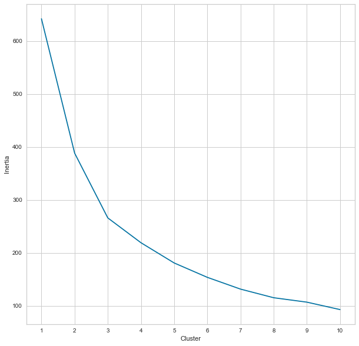
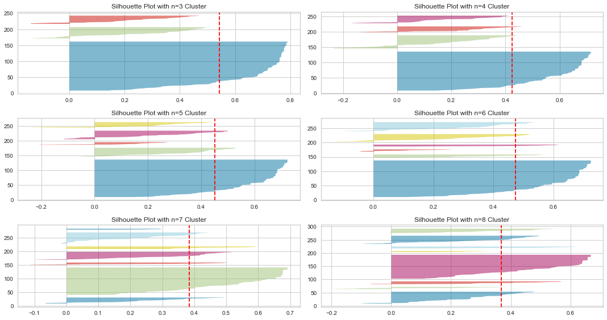
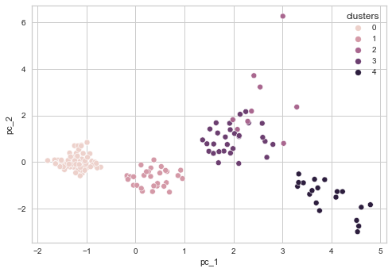
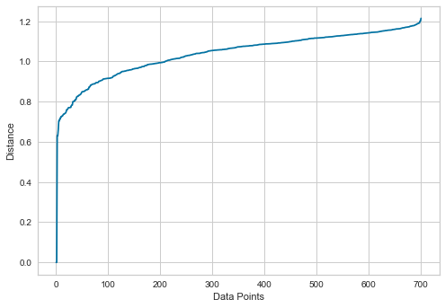
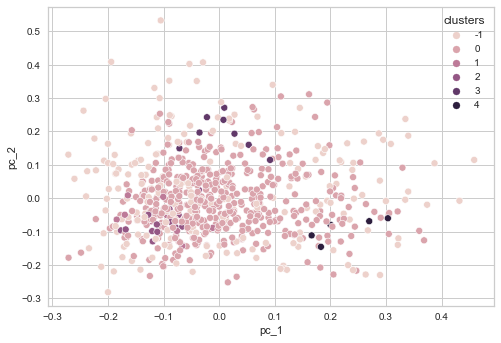

## Source ##
[Jurczyk, T. (2021, September 29). Clustering with scikit-learn in Python. Programming Historian. Retrieved October 4, 2022,
https://doi.org/10.46430/phen0094](https://programminghistorian.org/en/lessons/clustering-with-scikit-learn-in-python#how-does-k-means-work)

## Reflection ##
Clustering is a computational methods that separates data into different categories for future predictions. The application of clustering might be categorizing different literature and the clutered result can support/falsify a scholar's hypothesis. It can also provide insight for scholar to consider latent and new association among literatures. For example suppose someone predicts that certain literature's should be grouped together based on closely related their topics and key words in the abstract. Clustering can help them to achieve this goal. This historian class introduced two spatial clustering methods, k-means clustering and DBSCAN. The visualization of their result involved the implementation of Principle Component Analysis (PCA), which reduced the dimensionality of each data point while preserving the same spatial information in the original dataset. 

In the first case study we attempt to categorize 238 ancient authors from Greco-Roman antiquity and data was taken from the official Brill’s New Pauly website. Here we are mainly using numerical data information. In the this dataset we have 8 variables 'word_count', 'modern_translations', 'known_works', 'manuscripts', 'early_editions', 'early_translations', 'modern_editions', 'commentaries', and our goal is to cluster data points into groups based on the Euclidean distance among data points.

In the second study, we try to cluster using textual data. The main clustering method is `DBSCAN`. Detailed explaination for this method can be found [here](https://www.kdnuggets.com/2020/04/dbscan-clustering-algorithm-machine-learning.html).

### Different type of machine learing: ###
There different types of machine learning algorithm that can help scholars to run their clustering.
- `Supervised machine learning` uses labeled data to train machine learning algorithms to make accurate predictions for new data (i.e. k-nearest neighbors (KNN) and logistic regression).
- `Unsupervised learning` is applied to unlabeled data, DBSCAN is an unsupervised learning method (**Elbow method** or the **silhouette score** to evaluate the model’s output).
- `Reinforcement learning` is less used in digital humanities researches.
**notice: it is important to normalize data before clustering**

### Elbow Method ###
> "Inertia: the sum of squared distances of samples to their closest cluster center."

Inertia increases as the number of clusters increases. We stop when the decrease of inertia slows down after n nodes.

### Silhouette Score ###

> Formula: $\frac{(b-a)}{max(a,b)}$, where
> a= average intra-cluster distance i.e the average distance between each point within a cluster.
> b= average inter-cluster distance i.e the average distance between all clusters.

"The silhouette value is a measure of how similar an object is to its own cluster (cohesion) 
compared to other clusters (separation). The silhouette ranges from −1 to +1, where a high value indicates that the object is well matched to its own cluster and poorly matched to neighboring clusters. If most objects have a high value, then the clustering configuration is appropriate. If many points have a low or negative value, then the clustering configuration may have too many or too few clusters."

### k-means clustering ###
k-means clustering is based on Euclidean distance among data points. Detailed explaination can be found [here](https://en.wikipedia.org/wiki/K-means_clustering)

### DBSCAN ###
DBSCAN looks for dense regions of data points in a set while classifying data points without any direct neighbors as outliers or ‘noise points’. DBSCAN can be a great choice when dealing with datasets that are not linearly clustered but still include dense regions of data points.


-------------------------
## Code ##

## First Case Study: Applying K-Means to the Ancient Authors Dataset from Brill’s New Pauly ##
### 1. Exploring the Dataset ###


```python
import pandas as pd

# load the authors dataset that has been stored as a .csv files
df_authors = pd.read_csv("DNP_ancient_authors.csv", index_col="authors").drop(columns=["Unnamed: 0"])
print('Here are all the variables:',list(df_authors.columns))

# display some statistics
print('-------------------------------\n')
print('Descriptive Data')
print(df_authors.describe())

# show first 5 rows
print('-------------------------------\n')
print('HEAD')
df_authors.head(5)
```

    Here are all the variables: ['word_count', 'modern_translations', 'known_works', 'manuscripts', 'early_editions', 'early_translations', 'modern_editions', 'commentaries']
    -------------------------------
    
    Descriptive Data
            word_count  modern_translations  known_works  manuscripts  \
    count   238.000000           238.000000   238.000000   238.000000   
    mean    904.441176            12.970588     4.735294     4.512605   
    std     804.388666            16.553047     6.784297     4.637702   
    min      99.000000             0.000000     0.000000     0.000000   
    25%     448.750000             4.250000     1.000000     1.000000   
    50%     704.000000             9.000000     2.000000     3.000000   
    75%    1151.500000            15.750000     6.000000     6.000000   
    max    9406.000000           178.000000    65.000000    34.000000   
    
           early_editions  early_translations  modern_editions  commentaries  
    count      238.000000          238.000000       238.000000    238.000000  
    mean         5.823529            4.794118        10.399160      3.815126  
    std          4.250881            6.681706        11.652326      7.013509  
    min          0.000000            0.000000         0.000000      0.000000  
    25%          3.000000            0.000000         4.000000      0.000000  
    50%          5.000000            2.500000         7.000000      1.000000  
    75%          8.000000            8.000000        14.000000      4.000000  
    max         28.000000           39.000000       115.000000     43.000000  
    -------------------------------
    
    HEAD


<div>
<style scoped>
    .dataframe tbody tr th:only-of-type {
        vertical-align: middle;
    }

    .dataframe tbody tr th {
        vertical-align: top;
    }

    .dataframe thead th {
        text-align: right;
    }
</style>
<table border="1" class="dataframe">
  <thead>
    <tr style="text-align: right;">
      <th></th>
      <th>word_count</th>
      <th>modern_translations</th>
      <th>known_works</th>
      <th>manuscripts</th>
      <th>early_editions</th>
      <th>early_translations</th>
      <th>modern_editions</th>
      <th>commentaries</th>
    </tr>
    <tr>
      <th>authors</th>
      <th></th>
      <th></th>
      <th></th>
      <th></th>
      <th></th>
      <th></th>
      <th></th>
      <th></th>
    </tr>
  </thead>
  <tbody>
    <tr>
      <th>Achilles Tatius of Alexandria</th>
      <td>383</td>
      <td>5</td>
      <td>1</td>
      <td>2</td>
      <td>3</td>
      <td>9</td>
      <td>2</td>
      <td>1</td>
    </tr>
    <tr>
      <th>Aelianus Tacticus</th>
      <td>350</td>
      <td>1</td>
      <td>1</td>
      <td>0</td>
      <td>3</td>
      <td>6</td>
      <td>1</td>
      <td>0</td>
    </tr>
    <tr>
      <th>Aelianus, Claudius (Aelian)</th>
      <td>746</td>
      <td>8</td>
      <td>3</td>
      <td>6</td>
      <td>10</td>
      <td>8</td>
      <td>7</td>
      <td>0</td>
    </tr>
    <tr>
      <th>Aelius Aristides (Publius Aelius Aristides)</th>
      <td>2180</td>
      <td>26</td>
      <td>22</td>
      <td>7</td>
      <td>11</td>
      <td>6</td>
      <td>15</td>
      <td>1</td>
    </tr>
    <tr>
      <th>Aeneas Tacticus</th>
      <td>304</td>
      <td>5</td>
      <td>1</td>
      <td>1</td>
      <td>1</td>
      <td>2</td>
      <td>6</td>
      <td>0</td>
    </tr>
  </tbody>
</table>
</div>


```python
# display dataset structure with the pandas .info() method
print('\nINFO DATA')
df_authors.describe()
```

    
    INFO DATA


<div>
<style scoped>
    .dataframe tbody tr th:only-of-type {
        vertical-align: middle;
    }

    .dataframe tbody tr th {
        vertical-align: top;
    }

    .dataframe thead th {
        text-align: right;
    }
</style>
<table border="1" class="dataframe">
  <thead>
    <tr style="text-align: right;">
      <th></th>
      <th>word_count</th>
      <th>modern_translations</th>
      <th>known_works</th>
      <th>manuscripts</th>
      <th>early_editions</th>
      <th>early_translations</th>
      <th>modern_editions</th>
      <th>commentaries</th>
    </tr>
  </thead>
  <tbody>
    <tr>
      <th>count</th>
      <td>238.000000</td>
      <td>238.000000</td>
      <td>238.000000</td>
      <td>238.000000</td>
      <td>238.000000</td>
      <td>238.000000</td>
      <td>238.000000</td>
      <td>238.000000</td>
    </tr>
    <tr>
      <th>mean</th>
      <td>904.441176</td>
      <td>12.970588</td>
      <td>4.735294</td>
      <td>4.512605</td>
      <td>5.823529</td>
      <td>4.794118</td>
      <td>10.399160</td>
      <td>3.815126</td>
    </tr>
    <tr>
      <th>std</th>
      <td>804.388666</td>
      <td>16.553047</td>
      <td>6.784297</td>
      <td>4.637702</td>
      <td>4.250881</td>
      <td>6.681706</td>
      <td>11.652326</td>
      <td>7.013509</td>
    </tr>
    <tr>
      <th>min</th>
      <td>99.000000</td>
      <td>0.000000</td>
      <td>0.000000</td>
      <td>0.000000</td>
      <td>0.000000</td>
      <td>0.000000</td>
      <td>0.000000</td>
      <td>0.000000</td>
    </tr>
    <tr>
      <th>25%</th>
      <td>448.750000</td>
      <td>4.250000</td>
      <td>1.000000</td>
      <td>1.000000</td>
      <td>3.000000</td>
      <td>0.000000</td>
      <td>4.000000</td>
      <td>0.000000</td>
    </tr>
    <tr>
      <th>50%</th>
      <td>704.000000</td>
      <td>9.000000</td>
      <td>2.000000</td>
      <td>3.000000</td>
      <td>5.000000</td>
      <td>2.500000</td>
      <td>7.000000</td>
      <td>1.000000</td>
    </tr>
    <tr>
      <th>75%</th>
      <td>1151.500000</td>
      <td>15.750000</td>
      <td>6.000000</td>
      <td>6.000000</td>
      <td>8.000000</td>
      <td>8.000000</td>
      <td>14.000000</td>
      <td>4.000000</td>
    </tr>
    <tr>
      <th>max</th>
      <td>9406.000000</td>
      <td>178.000000</td>
      <td>65.000000</td>
      <td>34.000000</td>
      <td>28.000000</td>
      <td>39.000000</td>
      <td>115.000000</td>
      <td>43.000000</td>
    </tr>
  </tbody>
</table>
</div>


We only keep those data points in our data frame with a word count within the 90th percentile range.


```python
# remove outlier
ninety_quantile = df_authors["word_count"].quantile(0.9)
df_authors = df_authors[df_authors["word_count"] <= ninety_quantile]
```

### 2. Imports and Additional Functions ###
*All the functions are taken from the historian course*


```python
from sklearn.preprocessing import StandardScaler as SS # z-score standardization 
from sklearn.cluster import KMeans, DBSCAN # clustering algorithms
from sklearn.decomposition import PCA # dimensionality reduction
from sklearn.metrics import silhouette_score # used as a metric to evaluate the cohesion in a cluster
from sklearn.neighbors import NearestNeighbors # for selecting the optimal eps value when using DBSCAN
import numpy as np

# plotting libraries
import matplotlib.pyplot as plt
import seaborn as sns
from yellowbrick.cluster import SilhouetteVisualizer
```


```python
# The following function generates the silhouettePlot
def silhouettePlot(range_, data):
    half_length = int(len(range_)/2)
    range_list = list(range_)
    fig, ax = plt.subplots(half_length, 2, figsize=(15,8))
    for _ in range_:
        kmeans = KMeans(n_clusters=_, random_state=42)
        q, mod = divmod(_ - range_list[0], 2)
        sv = SilhouetteVisualizer(kmeans, colors="yellowbrick", ax=ax[q][mod])
        ax[q][mod].set_title("Silhouette Plot with n={} Cluster".format(_))
        sv.fit(data)
    fig.tight_layout()
    fig.show()
    fig.savefig("silhouette_plot.png")
```


```python
# The following function generates the elbowPlot
def elbowPlot(range_, data, figsize=(10,10)):
    inertia_list = []
    for n in range_:
        kmeans = KMeans(n_clusters=n, random_state=42)
        kmeans.fit(data)
        inertia_list.append(kmeans.inertia_)
        
    # plotting
    fig = plt.figure(figsize=figsize)
    ax = fig.add_subplot(111)
    sns.lineplot(y=inertia_list, x=range_, ax=ax)
    ax.set_xlabel("Cluster")
    ax.set_ylabel("Inertia")
    ax.set_xticks(list(range_))
    fig.show()
    fig.savefig("elbow_plot.png")
```


```python
# The folowing function assists us in finding the right eps value when using DBSCAN.
def findOptimalEps(n_neighbors, data):
    neigh = NearestNeighbors(n_neighbors=n_neighbors)
    nbrs = neigh.fit(data)
    distances, indices = nbrs.kneighbors(data)
    distances = np.sort(distances, axis=0)
    distances = distances[:,1]
    plt.plot(distances)
    plt.xlabel("Data Points")
    plt.ylabel("Distance")
    plt.savefig("eps_plot.png")
```


```python
def progressiveFeatureSelection(df, n_clusters=3, max_features=4,):
    feature_list = list(df.columns)
    selected_features = list()
    # select starting feature
    initial_feature = ""
    high_score = 0
    for feature in feature_list:
        kmeans = KMeans(n_clusters=n_clusters, random_state=42)
        data_ = df[feature]
        labels = kmeans.fit_predict(data_.to_frame())
        score_ = silhouette_score(data_.to_frame(), labels)
        print("Proposed new feature {} with score {}". format(feature, score_))
        if score_ >= high_score:
            initial_feature = feature
            high_score = score_
    print("The initial feature is {} with a silhouette score of {}.".format(initial_feature, high_score))
    feature_list.remove(initial_feature)
    selected_features.append(initial_feature)
    for _ in range(max_features-1):
        high_score = 0
        selected_feature = ""
        print("Starting selection {}...".format(_))
        for feature in feature_list:
            selection_ = selected_features.copy()
            selection_.append(feature)
            kmeans = KMeans(n_clusters=n_clusters, random_state=42)
            data_ = df[selection_]
            labels = kmeans.fit_predict(data_)
            score_ = silhouette_score(data_, labels)
            print("Proposed new feature {} with score {}". format(feature, score_))
            if score_ > high_score:
                selected_feature = feature
                high_score = score_
        selected_features.append(selected_feature)
        feature_list.remove(selected_feature)
        print("Selected new feature {} with score {}". format(selected_feature, high_score))
    return selected_features
```

### 3. Standardizing the DNP Ancient Authors Dataset ###
We uses *StandardScaler()* to standardize our dataset
Standardization means we are transforming numerical data into a new scale with **mean = 0** and **std = 1**. 


```python
scaler = SS()
DNP_authors_standardized = scaler.fit_transform(df_authors)
# we select all the numerical data to be standardized with mean of 0 and std of 1
df_authors_standardized = pd.DataFrame(DNP_authors_standardized, columns=["word_count_standardized", "modern_translations_standardized", "known_works_standardized", "manuscripts_standardized", "early_editions_standardized", "early_translations_standardized", "modern_editions_standardized", "commentaries_standardized"])
#run standardizer
df_authors_standardized = df_authors_standardized.set_index(df_authors.index)
```

### 4. Feature Selection ###
We want to keep the top three features with the highest `silhouette_score`. 


```python
selected_features = progressiveFeatureSelection(df_authors_standardized, max_features=3, n_clusters=3)
print(f'\nHere are all the features that we will use for later analysis: {selected_features}')
```

    Proposed new feature word_count_standardized with score 0.5815823896749474
    Proposed new feature modern_translations_standardized with score 0.592449382653205
    Proposed new feature known_works_standardized with score 0.7606223362466435
    Proposed new feature manuscripts_standardized with score 0.6193716240205519
    Proposed new feature early_editions_standardized with score 0.6054575587243932
    Proposed new feature early_translations_standardized with score 0.7025924996773049
    Proposed new feature modern_editions_standardized with score 0.6267499859538754
    Proposed new feature commentaries_standardized with score 0.7635590362947628
    The initial feature is commentaries_standardized with a silhouette score of 0.7635590362947628.
    Starting selection 0...
    Proposed new feature word_count_standardized with score 0.4982357331583712
    Proposed new feature modern_translations_standardized with score 0.4870986176486183
    Proposed new feature known_works_standardized with score 0.6248907485707674
    Proposed new feature manuscripts_standardized with score 0.49904671012606855
    Proposed new feature early_editions_standardized with score 0.48622842876757727
    Proposed new feature early_translations_standardized with score 0.5733248510430637
    Proposed new feature modern_editions_standardized with score 0.5746359517893044
    Selected new feature known_works_standardized with score 0.6248907485707674
    Starting selection 1...
    Proposed new feature word_count_standardized with score 0.5146900270599629
    Proposed new feature modern_translations_standardized with score 0.5115607116997266
    Proposed new feature manuscripts_standardized with score 0.4823694205460092
    Proposed new feature early_editions_standardized with score 0.4292187272532237
    Proposed new feature early_translations_standardized with score 0.48604410147460925
    Proposed new feature modern_editions_standardized with score 0.5434584440134395
    Selected new feature modern_editions_standardized with score 0.5434584440134395
    
    Here are all the features that we will use for later analysis: ['commentaries_standardized', 'known_works_standardized', 'modern_editions_standardized']


```python
df_standardized_sliced = df_authors_standardized[selected_features]
```

### 5. Choosing the Right Amount of Clusters5 ###
The following is the elbowPlot. We are looking for where the inertia decreases slows down, and it is about 3 or 4 clusters.


```python
elbowPlot(range(1,11), df_standardized_sliced)
```

    /var/folders/f2/y58lykxx4m1758sz41l2k92h0000gn/T/ipykernel_38319/4188287552.py:16: UserWarning: Matplotlib is currently using module://matplotlib_inline.backend_inline, which is a non-GUI backend, so cannot show the figure.
      fig.show()


    

    


The following is the silhouette Plot. We are looking higher average silhouette score of all data points, and it is about 3.


```python
silhouettePlot(range(3,9), df_standardized_sliced)
```

    /var/folders/f2/y58lykxx4m1758sz41l2k92h0000gn/T/ipykernel_38319/3045876518.py:13: UserWarning: Matplotlib is currently using module://matplotlib_inline.backend_inline, which is a non-GUI backend, so cannot show the figure.
      fig.show()


    

    


### 6. n=5 K-Means Analysis of the DNP Ancient Authors Dataset ###

We use PCA to reduce the dimension of our data to give us a better visualization of the clustering outcome.


```python
kmeans = KMeans(n_clusters=5, random_state=42)
cluster_labels = kmeans.fit_predict(df_standardized_sliced)
df_standardized_sliced["clusters"] = cluster_labels

# using PCA to reduce the dimensionality
pca = PCA(n_components=2, whiten=False, random_state=42)
authors_standardized_pca = pca.fit_transform(df_standardized_sliced)
df_authors_standardized_pca = pd.DataFrame(data=authors_standardized_pca, columns=["pc_1", "pc_2"])
df_authors_standardized_pca["clusters"] = cluster_labels

# plotting the clusters with seaborn
sns.scatterplot(x="pc_1", y="pc_2", hue="clusters", data=df_authors_standardized_pca)
```

    /var/folders/f2/y58lykxx4m1758sz41l2k92h0000gn/T/ipykernel_38319/1499513133.py:3: SettingWithCopyWarning: 
    A value is trying to be set on a copy of a slice from a DataFrame.
    Try using .loc[row_indexer,col_indexer] = value instead
    
    See the caveats in the documentation: https://pandas.pydata.org/pandas-docs/stable/user_guide/indexing.html#returning-a-view-versus-a-copy
      df_standardized_sliced["clusters"] = cluster_labels


    <AxesSubplot:xlabel='pc_1', ylabel='pc_2'>


    

    


-------------
-------------
## Second Case Study: Clustering Textual Data ##
In the second study, we try to cluster using textual data. The main clustering method is `DBSCAN`. Detailed explaination for this method can be found [here](https://www.kdnuggets.com/2020/04/dbscan-clustering-algorithm-machine-learning.html).
### 1. Loading the Dataset & Exploratory Data Analysis
We use *RELIGION_abstracts.csv* for this study.


```python
df_abstracts = pd.read_csv("RELIGION_abstracts.csv").drop(columns="Unnamed: 0")
df_abstracts.info()
print('\n-------------------------------\nHead rows')
df_abstracts.head()
```

    <class 'pandas.core.frame.DataFrame'>
    RangeIndex: 701 entries, 0 to 700
    Data columns (total 4 columns):
     #   Column    Non-Null Count  Dtype 
    ---  ------    --------------  ----- 
     0   title     701 non-null    object
     1   abstract  701 non-null    object
     2   link      701 non-null    object
     3   volume    701 non-null    object
    dtypes: object(4)
    memory usage: 22.0+ KB
    
    -------------------------------
    Head rows


<div>
<style scoped>
    .dataframe tbody tr th:only-of-type {
        vertical-align: middle;
    }

    .dataframe tbody tr th {
        vertical-align: top;
    }

    .dataframe thead th {
        text-align: right;
    }
</style>
<table border="1" class="dataframe">
  <thead>
    <tr style="text-align: right;">
      <th></th>
      <th>title</th>
      <th>abstract</th>
      <th>link</th>
      <th>volume</th>
    </tr>
  </thead>
  <tbody>
    <tr>
      <th>0</th>
      <td>Norwegian Muslims denouncing terrorism: beyond...</td>
      <td>In contemporary European societies, Muslims ar...</td>
      <td>https://www.tandfonline.com/doi/full/10.1080/0...</td>
      <td>https://www.tandfonline.com/loi/rrel20?treeId=...</td>
    </tr>
    <tr>
      <th>1</th>
      <td>A comparative analysis of three Sunni Muslim o...</td>
      <td>The distinction between ‘moderate’ and ‘radica...</td>
      <td>https://www.tandfonline.com/doi/full/10.1080/0...</td>
      <td>https://www.tandfonline.com/loi/rrel20?treeId=...</td>
    </tr>
    <tr>
      <th>2</th>
      <td>Musical negotiations of a ‘moderate’ versus a ...</td>
      <td>This article explores how in Morocco, music is...</td>
      <td>https://www.tandfonline.com/doi/full/10.1080/0...</td>
      <td>https://www.tandfonline.com/loi/rrel20?treeId=...</td>
    </tr>
    <tr>
      <th>3</th>
      <td>Aesthetics of authority: ‘Islam Nusantara’ and...</td>
      <td>In Indonesia, Islamic ‘counter-terror culture’...</td>
      <td>https://www.tandfonline.com/doi/full/10.1080/0...</td>
      <td>https://www.tandfonline.com/loi/rrel20?treeId=...</td>
    </tr>
    <tr>
      <th>4</th>
      <td>Countering ‘Islamic’ violent extremism? The im...</td>
      <td>This article explores how Muslim-led civil soc...</td>
      <td>https://www.tandfonline.com/doi/full/10.1080/0...</td>
      <td>https://www.tandfonline.com/loi/rrel20?treeId=...</td>
    </tr>
  </tbody>
</table>
</div>


```python
df_abstracts.describe()
```


<div>
<style scoped>
    .dataframe tbody tr th:only-of-type {
        vertical-align: middle;
    }

    .dataframe tbody tr th {
        vertical-align: top;
    }

    .dataframe thead th {
        text-align: right;
    }
</style>
<table border="1" class="dataframe">
  <thead>
    <tr style="text-align: right;">
      <th></th>
      <th>title</th>
      <th>abstract</th>
      <th>link</th>
      <th>volume</th>
    </tr>
  </thead>
  <tbody>
    <tr>
      <th>count</th>
      <td>701</td>
      <td>701</td>
      <td>701</td>
      <td>701</td>
    </tr>
    <tr>
      <th>unique</th>
      <td>701</td>
      <td>701</td>
      <td>701</td>
      <td>40</td>
    </tr>
    <tr>
      <th>top</th>
      <td>Norwegian Muslims denouncing terrorism: beyond...</td>
      <td>In contemporary European societies, Muslims ar...</td>
      <td>https://www.tandfonline.com/doi/full/10.1080/0...</td>
      <td>https://www.tandfonline.com/loi/rrel20?treeId=...</td>
    </tr>
    <tr>
      <th>freq</th>
      <td>1</td>
      <td>1</td>
      <td>1</td>
      <td>41</td>
    </tr>
  </tbody>
</table>
</div>


### Optional step: Lemmatization ###
Lemmatization is the process of grouping together the different inflected forms of a word so they can be analyzed as a single item.


```python
import spacy
import re
nlp = spacy.load("en_core_web_sm")

def lemmatizeAbstracts(x):
        doc = nlp(x)
        new_text = []
        for token in doc:
            new_text.append(token.lemma_)
        text_string = " ".join(new_text)
        # getting rid of non-word characters
        text_string = re.sub(r"[^\w\s]+", "", text_string)
        text_string = re.sub(r"\s{2,}", " ", text_string)
        return text_string

df_abstracts["abstract_lemma"] = df_abstracts["abstract"].apply(lemmatizeAbstracts)
df_abstracts.to_csv("RELIGION_abstracts_lemmatized.csv")
```

After compare the text before and after Lemmatization, we found that we removed all the punctuation in the Lemmatization process (see code block below).


```python
print(df_abstracts["abstract"][1])
print('------------------------\n',df_abstracts["abstract_lemma"][1])
```

    The distinction between ‘moderate’ and ‘radical’ Islam has played a key role in tackling contemporary militant religious extremism. This article examines three prominent Sunni Muslim institutions that uphold this distinction and present themselves as the peaceful and moderate voices of ‘true Islam’, namely al-Azhar al-Sharīf of Egypt, Nahdlatul Ulama of Indonesia and al-Rabita al-Muhammadiyya lil-‘Ulama’ of Morocco. The article provides a critical, comparative analysis of their religious discourses and theological strategies in developing an ‘exceptional’ and ‘moderate’ Sunni response to jihadist militancy, particularly after the emergence of the so-called ‘Islamic State’ in Syria and Iraq (IS). It demonstrates that each institution has developed its own brand of moderateness with different motivations, argumentations, content and religious justifications. As such, this article challenges the moderate-versus-radical dichotomy by revealing that there are multiple discourses on moderation, instead of it being one single and coherent moderate bloc.
    ------------------------
     the distinction between moderate and radical Islam have play a key role in tackle contemporary militant religious extremism this article examine three prominent Sunni muslim institution that uphold this distinction and present themselves as the peaceful and moderate voice of true Islam namely al Azhar al Sharīf of Egypt Nahdlatul Ulama of Indonesia and al Rabita al Muhammadiyya lilUlama of Morocco the article provide a critical comparative analysis of their religious discourse and theological strategy in develop an exceptional and moderate sunni response to jihadist militancy particularly after the emergence of the so call Islamic State in Syria and Iraq IS it demonstrate that each institution have develop its own brand of moderateness with different motivation argumentation content and religious justification as such this article challenge the moderate versus radical dichotomy by reveal that there be multiple discourse on moderation instead of it be one single and coherent moderate bloc 


### 2. TF-IDF Vectorization ###
Change texts to vector form


```python
from sklearn.feature_extraction.text import TfidfVectorizer
tfidf = TfidfVectorizer(stop_words="english")
tfidf = TfidfVectorizer(stop_words="english", ngram_range=(1,2), max_features=250, strip_accents="unicode", min_df=10, max_df=200)
tfidf_religion_array = tfidf.fit_transform(df_abstracts["abstract_lemma"])
df_abstracts_tfidf = pd.DataFrame(tfidf_religion_array.toarray(), index=df_abstracts.index, columns=tfidf.get_feature_names())
df_abstracts_tfidf.describe()
```

    /Users/selenahu/opt/miniconda3/envs/diamonds2022/lib/python3.10/site-packages/sklearn/utils/deprecation.py:87: FutureWarning: Function get_feature_names is deprecated; get_feature_names is deprecated in 1.0 and will be removed in 1.2. Please use get_feature_names_out instead.
      warnings.warn(msg, category=FutureWarning)


<div>
<style scoped>
    .dataframe tbody tr th:only-of-type {
        vertical-align: middle;
    }

    .dataframe tbody tr th {
        vertical-align: top;
    }

    .dataframe thead th {
        text-align: right;
    }
</style>
<table border="1" class="dataframe">
  <thead>
    <tr style="text-align: right;">
      <th></th>
      <th>academic</th>
      <th>account</th>
      <th>activity</th>
      <th>address</th>
      <th>african</th>
      <th>agency</th>
      <th>aim</th>
      <th>allow</th>
      <th>american</th>
      <th>analyse</th>
      <th>...</th>
      <th>use</th>
      <th>value</th>
      <th>various</th>
      <th>view</th>
      <th>way</th>
      <th>western</th>
      <th>woman</th>
      <th>work</th>
      <th>world</th>
      <th>year</th>
    </tr>
  </thead>
  <tbody>
    <tr>
      <th>count</th>
      <td>701.000000</td>
      <td>701.000000</td>
      <td>701.000000</td>
      <td>701.000000</td>
      <td>701.000000</td>
      <td>701.000000</td>
      <td>701.000000</td>
      <td>701.000000</td>
      <td>701.000000</td>
      <td>701.000000</td>
      <td>...</td>
      <td>701.000000</td>
      <td>701.000000</td>
      <td>701.000000</td>
      <td>701.000000</td>
      <td>701.000000</td>
      <td>701.000000</td>
      <td>701.000000</td>
      <td>701.000000</td>
      <td>701.000000</td>
      <td>701.000000</td>
    </tr>
    <tr>
      <th>mean</th>
      <td>0.017407</td>
      <td>0.017756</td>
      <td>0.010633</td>
      <td>0.011059</td>
      <td>0.011356</td>
      <td>0.009061</td>
      <td>0.010451</td>
      <td>0.009127</td>
      <td>0.015210</td>
      <td>0.011713</td>
      <td>...</td>
      <td>0.033074</td>
      <td>0.014268</td>
      <td>0.013633</td>
      <td>0.021310</td>
      <td>0.027744</td>
      <td>0.021257</td>
      <td>0.018406</td>
      <td>0.028048</td>
      <td>0.028877</td>
      <td>0.014563</td>
    </tr>
    <tr>
      <th>std</th>
      <td>0.063839</td>
      <td>0.067667</td>
      <td>0.051894</td>
      <td>0.047114</td>
      <td>0.065659</td>
      <td>0.053946</td>
      <td>0.045080</td>
      <td>0.042445</td>
      <td>0.068153</td>
      <td>0.051143</td>
      <td>...</td>
      <td>0.074190</td>
      <td>0.061468</td>
      <td>0.052642</td>
      <td>0.064568</td>
      <td>0.062593</td>
      <td>0.078245</td>
      <td>0.095377</td>
      <td>0.074917</td>
      <td>0.073751</td>
      <td>0.052971</td>
    </tr>
    <tr>
      <th>min</th>
      <td>0.000000</td>
      <td>0.000000</td>
      <td>0.000000</td>
      <td>0.000000</td>
      <td>0.000000</td>
      <td>0.000000</td>
      <td>0.000000</td>
      <td>0.000000</td>
      <td>0.000000</td>
      <td>0.000000</td>
      <td>...</td>
      <td>0.000000</td>
      <td>0.000000</td>
      <td>0.000000</td>
      <td>0.000000</td>
      <td>0.000000</td>
      <td>0.000000</td>
      <td>0.000000</td>
      <td>0.000000</td>
      <td>0.000000</td>
      <td>0.000000</td>
    </tr>
    <tr>
      <th>25%</th>
      <td>0.000000</td>
      <td>0.000000</td>
      <td>0.000000</td>
      <td>0.000000</td>
      <td>0.000000</td>
      <td>0.000000</td>
      <td>0.000000</td>
      <td>0.000000</td>
      <td>0.000000</td>
      <td>0.000000</td>
      <td>...</td>
      <td>0.000000</td>
      <td>0.000000</td>
      <td>0.000000</td>
      <td>0.000000</td>
      <td>0.000000</td>
      <td>0.000000</td>
      <td>0.000000</td>
      <td>0.000000</td>
      <td>0.000000</td>
      <td>0.000000</td>
    </tr>
    <tr>
      <th>50%</th>
      <td>0.000000</td>
      <td>0.000000</td>
      <td>0.000000</td>
      <td>0.000000</td>
      <td>0.000000</td>
      <td>0.000000</td>
      <td>0.000000</td>
      <td>0.000000</td>
      <td>0.000000</td>
      <td>0.000000</td>
      <td>...</td>
      <td>0.000000</td>
      <td>0.000000</td>
      <td>0.000000</td>
      <td>0.000000</td>
      <td>0.000000</td>
      <td>0.000000</td>
      <td>0.000000</td>
      <td>0.000000</td>
      <td>0.000000</td>
      <td>0.000000</td>
    </tr>
    <tr>
      <th>75%</th>
      <td>0.000000</td>
      <td>0.000000</td>
      <td>0.000000</td>
      <td>0.000000</td>
      <td>0.000000</td>
      <td>0.000000</td>
      <td>0.000000</td>
      <td>0.000000</td>
      <td>0.000000</td>
      <td>0.000000</td>
      <td>...</td>
      <td>0.000000</td>
      <td>0.000000</td>
      <td>0.000000</td>
      <td>0.000000</td>
      <td>0.000000</td>
      <td>0.000000</td>
      <td>0.000000</td>
      <td>0.000000</td>
      <td>0.000000</td>
      <td>0.000000</td>
    </tr>
    <tr>
      <th>max</th>
      <td>0.493789</td>
      <td>0.709637</td>
      <td>0.509307</td>
      <td>0.360085</td>
      <td>0.737092</td>
      <td>0.658383</td>
      <td>0.359469</td>
      <td>0.409185</td>
      <td>0.617276</td>
      <td>0.457299</td>
      <td>...</td>
      <td>0.609089</td>
      <td>0.828761</td>
      <td>0.534004</td>
      <td>0.515410</td>
      <td>0.364839</td>
      <td>0.724760</td>
      <td>0.941362</td>
      <td>0.604694</td>
      <td>0.492094</td>
      <td>0.365748</td>
    </tr>
  </tbody>
</table>
<p>8 rows × 250 columns</p>
</div>


### 3. Dimensionality Reduction Using PCA ###
We reduce the dimensionality of our dataset.


```python
pca = PCA(n_components=10, whiten=False, random_state=42)
abstracts_pca = pca.fit_transform(df_abstracts_tfidf)
df_abstracts_pca = pd.DataFrame(data=abstracts_pca)
```

notice the difference between the dataframes **df_abstracts_pca** and **df_abstracts_tfidf**


```python
df_abstracts_pca
```


<div>
<style scoped>
    .dataframe tbody tr th:only-of-type {
        vertical-align: middle;
    }

    .dataframe tbody tr th {
        vertical-align: top;
    }

    .dataframe thead th {
        text-align: right;
    }
</style>
<table border="1" class="dataframe">
  <thead>
    <tr style="text-align: right;">
      <th></th>
      <th>0</th>
      <th>1</th>
      <th>2</th>
      <th>3</th>
      <th>4</th>
      <th>5</th>
      <th>6</th>
      <th>7</th>
      <th>8</th>
      <th>9</th>
    </tr>
  </thead>
  <tbody>
    <tr>
      <th>0</th>
      <td>-0.087536</td>
      <td>-0.133754</td>
      <td>-0.019252</td>
      <td>-0.127524</td>
      <td>0.188059</td>
      <td>0.079132</td>
      <td>-0.014340</td>
      <td>-0.032934</td>
      <td>0.239940</td>
      <td>-0.081444</td>
    </tr>
    <tr>
      <th>1</th>
      <td>-0.100590</td>
      <td>-0.184206</td>
      <td>-0.063085</td>
      <td>-0.169670</td>
      <td>0.244982</td>
      <td>0.102516</td>
      <td>-0.014914</td>
      <td>-0.090813</td>
      <td>0.278014</td>
      <td>-0.161025</td>
    </tr>
    <tr>
      <th>2</th>
      <td>-0.135874</td>
      <td>-0.110891</td>
      <td>-0.008002</td>
      <td>-0.064511</td>
      <td>0.363380</td>
      <td>0.108146</td>
      <td>-0.041419</td>
      <td>-0.082428</td>
      <td>0.291033</td>
      <td>-0.168784</td>
    </tr>
    <tr>
      <th>3</th>
      <td>-0.107712</td>
      <td>-0.138008</td>
      <td>-0.056803</td>
      <td>-0.137601</td>
      <td>0.269000</td>
      <td>0.133273</td>
      <td>-0.044879</td>
      <td>-0.071159</td>
      <td>0.271787</td>
      <td>-0.106355</td>
    </tr>
    <tr>
      <th>4</th>
      <td>-0.011910</td>
      <td>-0.151941</td>
      <td>0.018459</td>
      <td>-0.185845</td>
      <td>0.245275</td>
      <td>0.103453</td>
      <td>0.064013</td>
      <td>-0.073901</td>
      <td>0.214777</td>
      <td>-0.032233</td>
    </tr>
    <tr>
      <th>...</th>
      <td>...</td>
      <td>...</td>
      <td>...</td>
      <td>...</td>
      <td>...</td>
      <td>...</td>
      <td>...</td>
      <td>...</td>
      <td>...</td>
      <td>...</td>
    </tr>
    <tr>
      <th>696</th>
      <td>0.172567</td>
      <td>-0.003118</td>
      <td>0.147293</td>
      <td>0.031122</td>
      <td>0.175650</td>
      <td>0.071933</td>
      <td>0.056937</td>
      <td>-0.038804</td>
      <td>-0.070862</td>
      <td>0.024917</td>
    </tr>
    <tr>
      <th>697</th>
      <td>-0.034094</td>
      <td>-0.003756</td>
      <td>0.008462</td>
      <td>-0.112967</td>
      <td>-0.038806</td>
      <td>0.000519</td>
      <td>-0.075537</td>
      <td>-0.050137</td>
      <td>-0.048811</td>
      <td>0.128039</td>
    </tr>
    <tr>
      <th>698</th>
      <td>0.005142</td>
      <td>0.090452</td>
      <td>0.043544</td>
      <td>0.103490</td>
      <td>-0.047075</td>
      <td>0.061992</td>
      <td>0.008298</td>
      <td>-0.046505</td>
      <td>-0.026135</td>
      <td>-0.148307</td>
    </tr>
    <tr>
      <th>699</th>
      <td>-0.060472</td>
      <td>-0.051475</td>
      <td>0.036484</td>
      <td>0.050968</td>
      <td>0.112632</td>
      <td>0.022258</td>
      <td>-0.148895</td>
      <td>-0.055882</td>
      <td>0.104067</td>
      <td>-0.052197</td>
    </tr>
    <tr>
      <th>700</th>
      <td>0.018514</td>
      <td>-0.032739</td>
      <td>-0.130765</td>
      <td>0.108108</td>
      <td>-0.088974</td>
      <td>-0.034801</td>
      <td>-0.120599</td>
      <td>0.107453</td>
      <td>0.054444</td>
      <td>0.008300</td>
    </tr>
  </tbody>
</table>
<p>701 rows × 10 columns</p>
</div>


```python
# graph k-means clustering after PCA
kmeans = KMeans(n_clusters=100, random_state=42)
abstracts_labels = kmeans.fit_predict(df_abstracts_pca)
df_abstracts_labeled = df_abstracts.copy()
df_abstracts_labeled["cluster"] = abstracts_labels
```


```python
df_abstracts_labeled[df_abstracts_labeled["cluster"] == 75][["title", "cluster"]]
```


<div>
<style scoped>
    .dataframe tbody tr th:only-of-type {
        vertical-align: middle;
    }

    .dataframe tbody tr th {
        vertical-align: top;
    }

    .dataframe thead th {
        text-align: right;
    }
</style>
<table border="1" class="dataframe">
  <thead>
    <tr style="text-align: right;">
      <th></th>
      <th>title</th>
      <th>cluster</th>
    </tr>
  </thead>
  <tbody>
    <tr>
      <th>28</th>
      <td>The space between us: considering online media...</td>
      <td>75</td>
    </tr>
    <tr>
      <th>39</th>
      <td>Towards increasing diversity in the study of r...</td>
      <td>75</td>
    </tr>
    <tr>
      <th>61</th>
      <td>Qur’anic terminology, translation, and the Isl...</td>
      <td>75</td>
    </tr>
    <tr>
      <th>88</th>
      <td>From nation-state to market: The transformatio...</td>
      <td>75</td>
    </tr>
    <tr>
      <th>243</th>
      <td>More than belief, but not more than belief and...</td>
      <td>75</td>
    </tr>
    <tr>
      <th>279</th>
      <td>The role of evolutionary psychology within an ...</td>
      <td>75</td>
    </tr>
    <tr>
      <th>389</th>
      <td>A case of misrepresentation: James L. Cox and ...</td>
      <td>75</td>
    </tr>
    <tr>
      <th>436</th>
      <td>Epidemiology and the study of religion</td>
      <td>75</td>
    </tr>
    <tr>
      <th>682</th>
      <td>The theological enemies of religious studies</td>
      <td>75</td>
    </tr>
  </tbody>
</table>
</div>


```python
df_abstracts_labeled[df_abstracts_labeled["cluster"] == 82][["title", "cluster"]]
```


<div>
<style scoped>
    .dataframe tbody tr th:only-of-type {
        vertical-align: middle;
    }

    .dataframe tbody tr th {
        vertical-align: top;
    }

    .dataframe thead th {
        text-align: right;
    }
</style>
<table border="1" class="dataframe">
  <thead>
    <tr style="text-align: right;">
      <th></th>
      <th>title</th>
      <th>cluster</th>
    </tr>
  </thead>
  <tbody>
    <tr>
      <th>250</th>
      <td>Religious history as religious studies</td>
      <td>82</td>
    </tr>
    <tr>
      <th>259</th>
      <td>‘Western Learning’, religious plurality, and t...</td>
      <td>82</td>
    </tr>
    <tr>
      <th>521</th>
      <td>Evolutionism and Early Nineteenth-Century Hist...</td>
      <td>82</td>
    </tr>
    <tr>
      <th>556</th>
      <td>The Gospel according to the Jesus Seminar</td>
      <td>82</td>
    </tr>
  </tbody>
</table>
</div>


### 5. Applying DBSCAN Clustering on Textual Data ###


```python
findOptimalEps(2, df_abstracts_tfidf)
```


    

    


```python
dbscan = DBSCAN(eps=0.19, metric="euclidean")
dbscan_labels = dbscan.fit_predict(df_abstracts_pca)
df_abstracts_dbscan = df_abstracts.copy()
df_abstracts_dbscan["cluster"] = dbscan_labels
df_abstracts_dbscan["cluster"].unique()
```


    array([ 0, -1,  1,  3,  2,  4])


```python
df_abstracts_dbscan[df_abstracts_dbscan["cluster"] == 1][["title", "cluster"]]
```


<div>
<style scoped>
    .dataframe tbody tr th:only-of-type {
        vertical-align: middle;
    }

    .dataframe tbody tr th {
        vertical-align: top;
    }

    .dataframe thead th {
        text-align: right;
    }
</style>
<table border="1" class="dataframe">
  <thead>
    <tr style="text-align: right;">
      <th></th>
      <th>title</th>
      <th>cluster</th>
    </tr>
  </thead>
  <tbody>
    <tr>
      <th>14</th>
      <td>Imagining Buddhist modernism: the shared relig...</td>
      <td>1</td>
    </tr>
    <tr>
      <th>20</th>
      <td>Why Durkheim really thought that Buddhism was ...</td>
      <td>1</td>
    </tr>
    <tr>
      <th>158</th>
      <td>Textbook Buddhism: introductory books on the B...</td>
      <td>1</td>
    </tr>
    <tr>
      <th>439</th>
      <td>Recent trends in Sri Lankan Buddhism</td>
      <td>1</td>
    </tr>
    <tr>
      <th>471</th>
      <td>William James and Buddhism: American Pragmatis...</td>
      <td>1</td>
    </tr>
    <tr>
      <th>559</th>
      <td>Buddhist Environmental Ethics and Detraditiona...</td>
      <td>1</td>
    </tr>
    <tr>
      <th>620</th>
      <td>Buddhadharma and contemporary ethics</td>
      <td>1</td>
    </tr>
    <tr>
      <th>631</th>
      <td>How environmentalist is Buddhism?</td>
      <td>1</td>
    </tr>
    <tr>
      <th>638</th>
      <td>Protestant Buddhism?</td>
      <td>1</td>
    </tr>
    <tr>
      <th>690</th>
      <td>Burial ‘ad sanctos’ and the physical presence ...</td>
      <td>1</td>
    </tr>
  </tbody>
</table>
</div>


### 6. Visualizing DBSCAN Results ###


```python
pca = PCA(n_components=2, whiten=False, random_state=42)
dbscan_pca_2d = pca.fit_transform(df_abstracts_tfidf)
df_dbscan_2d = pd.DataFrame(data=dbscan_pca_2d, columns=["pc_1", "pc_2"])
df_dbscan_2d["clusters"] = dbscan_labels
```


```python
sns_plot = sns.scatterplot(x="pc_1", y="pc_2", hue="clusters", data=df_dbscan_2d)
```


    

    

