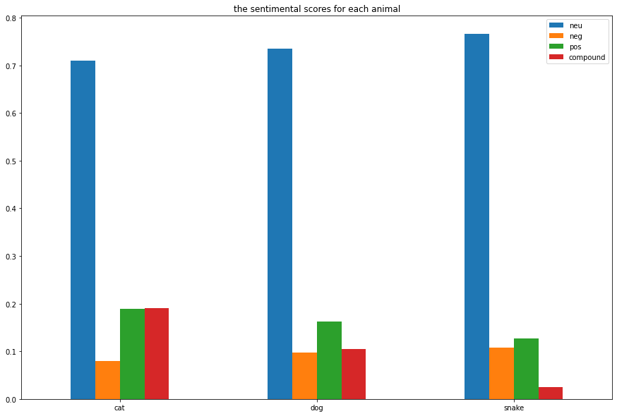
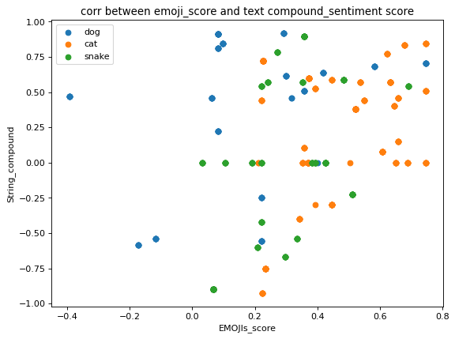

## Project Inspiration
This project is inspired by the book “The Internet is for Cats,” which explains how digital images of animals have shaped our digital life. The book introduced the concept of the imbalanced relationship between the viewer and cute objects, animals, and people. Some argue that our predilection towards cuteness could be a “specific type of relationship between consumer object and the weak objects predicated on feelings of care and empathy”. We inherently view cute objects as weak, and viewers of cute objects are the ones in power. On the contrary, scholars such as Simon May argue that cuteness may function as “subversive trickery”. To be more specific cuteness may “play with mocks and ironize the value we attach to power – as well as our assumption about who has power and who doesn’t?” Thus, the goal of this research is to study how images of animals are potentially used as a social practice, correlate with people’s emotions, and change human perception.  

I will use Twitter posts with various hashtags for different animal species. All the data will be extracted through python and Twitter API. I choose to use Twitter because of its data accessibility, data abundance, and popularity. Compared to other popular and trending social media applications such as Tiktok, Tweets involve more text and are better for textual analysis. I plan to use four hashtags related to different animal species, including cat, dog, and snakes. For each tag, 1000 tweets were collected using the tweepy function in python. Here is the link to its document page https://docs.tweepy.org/en/stable/ . I am going to follow the steps stated in the following two videos to gather data
-	 How to get TWEETS by Python | Twitter API 2022 
-	 Get TWEETS by User and Hashtag with Python | Twitter API 2022 
After the information is gathered from the API, all the text information will be processed and cleaned using the python libraries.   

## Goals:
The goal of this project is to understand:

1) how sentimental scores vary across different animal tweets

2) the sentimental relationship between emojis and textual message

## Data Gathering
I gathered data from twitter using tweepy API in Python. I gathered 1000 tweets from each of the following hashtags:
1. #dag
2. #cat
3. #snakes

### Here are the codes:
```python
from ast import keyword
import tweepy
import configparser
import pandas as pd

config = configparser.ConfigParser()
config.read('config.ini')

api_key = config['twitter']['api_key']
api_key_secret = config['twitter']['api_key_secret']
access_token = config['twitter']['access_token']
access_token_secret= config['twitter']['access_token_secret']

# authentication
auth = tweepy.OAuthHandler(api_key,api_key_secret)
auth.set_access_token(access_token,access_token_secret)
api = tweepy.API(auth)

keywords = 'dogs'
limits = 200

# tweets = api.search_tweets(q=keywords, count = 10)
c = 0
data = []
for i in range(5):
    tweets = tweepy.Cursor(api.search_tweets, q=keywords, count = c, tweet_mode = 'extended').items(limits)
    for tweet in tweets:
        data.append(tweet.full_text)
        
    c = c+ 300
#print(df2)

df = pd.DataFrame(data,columns = ['text'])
print(df)
df.to_csv('dog2.csv')
```

## Data Cleaning
After extracting tweets for each animal tag, we cleaned data in the following block. Here is a summary of what I did in the following code:
1. Select only tweets in English
2. Extract emoji from texts
3. Remove emoji from texts
4. Extract all the hashtags
5. Remove website links, extra spaces, and @


```python
from langdetect import detect
import pandas as pd
import spacy
import re
import copy
import emoji

nlp = spacy.load("en_core_web_sm")
nlp.disable_pipes('ner', 'parser') 
animal = 'snake'
df0 = pd.read_csv('snakes.csv')


def extract_emojis(s):
    text = ''.join(c for c in s if c not in emoji.EMOJI_DATA)
    emojis_list = ''.join(c for c in s if c in emoji.EMOJI_DATA)
    return emojis_list,text


def isEnglish(s):
    lang = detect(s)

    return lang

# def process_text(text):
#     """Remove new line characters and lemmatize text. Returns string of lemmas"""
#     doc = nlp(text)
#     tokens = [token for token in doc]
#     no_stops = [token for token in tokens if not token.is_stop]
#     no_punct = [token for token in no_stops if token.is_alpha]
#     lemmas = [token.lemma_ for token in no_punct]
#     lemmas_lower = [lemma.lower() for lemma in lemmas]
#     lemmas_string = ' '.join(lemmas_lower)
#     return lemmas_string


def hashtag_search(text):
    text = text.replace('\n', ' ')
    words = text.split()
    copy_words = copy.deepcopy(words)
    hash_list = []

    for w in words:
        if w == '' or  w == ' ' or w == 'RT' or w == "||":
            copy_words.remove(w)
        # check if there are non-english character
        #if isEnglish(w): 
        # find hashtag
        x = re.search('^#', w)
        if x:
            hash_list.append(w)
            copy_words.remove(w)
            continue
        # find website address and @
        y = re.search('^[http,&,@]', w)
        if y:
            copy_words.remove(w)
            continue
            #
#             z = re.search('[0-9]',w)
#             if z:
#                 copy_words.remove(w)
#                 continue
#         else: 
#             language = 'other'
#             copy_words.remove(w)
    string = ' '.join(copy_words)
    hashtag = ' '.join(hash_list)
    
    return hashtag,string
    

df = df0.reindex(columns=['text','EMOJIs','string','hashtag','animal','language'], fill_value=0)
for i in range(1000):
    #check if the language is english
    emojis,text = extract_emojis(df.iloc[i]['text'])
    df.at[i,'EMOJIs'] = emojis
    language = isEnglish(text)
    df.at[i,'language']=language
 #############   
    if language == 'en':
        hashtag,string = hashtag_search(text)
        #process_string = process_text(string)
        df.at[i,'hashtag'] =  hashtag
        df.at[i,'string'] = string
#         df.at[i,'lemma_string'] = process_string
    df.at[i,'animal'] = animal
 ############# 
    
english_df = df[df["language"] == 'en']
english_df[:30]
english_df.to_csv(f'{animal}_processed.csv')
```

## Import Data


```python
import pandas as pd
from nltk.sentiment.vader import SentimentIntensityAnalyzer
cat_df = pd.read_csv("cat_processed.csv")
dog_df = pd.read_csv("dog_processed.csv")
snake_df = pd.read_csv("snake_processed.csv")

cat_df[1:10]
```


<div>
<style scoped>
    .dataframe tbody tr th:only-of-type {
        vertical-align: middle;
    }

    .dataframe tbody tr th {
        vertical-align: top;
    }

    .dataframe thead th {
        text-align: right;
    }
</style>
<table border="1" class="dataframe">
  <thead>
    <tr style="text-align: right;">
      <th></th>
      <th>Unnamed: 0</th>
      <th>text</th>
      <th>EMOJIs</th>
      <th>string</th>
      <th>hashtag</th>
      <th>animal</th>
      <th>language</th>
    </tr>
  </thead>
  <tbody>
    <tr>
      <th>1</th>
      <td>2</td>
      <td>My cat, Sury, seeing the fresh start of my Twi...</td>
      <td>NaN</td>
      <td>My cat, Sury, seeing fresh start of my Twitter...</td>
      <td>#TWITTER #TwitterBlueTick #cat #cats #CatsOfTw...</td>
      <td>cat</td>
      <td>en</td>
    </tr>
    <tr>
      <th>2</th>
      <td>9</td>
      <td>RT @AdoptWoodCntyHS: Adoptable #Cat #Jester_WC...</td>
      <td>♥</td>
      <td>Adoptable Just a few reasons why you want star...</td>
      <td>#Cat #Jester_WCHSOH_01 #fostercat #catlove</td>
      <td>cat</td>
      <td>en</td>
    </tr>
    <tr>
      <th>3</th>
      <td>10</td>
      <td>RT @RappCatsAdopt: Prayers for Dwight please. ...</td>
      <td>NaN</td>
      <td>Prayers for Dwight He seemed OK yesterday now ...</td>
      <td>NaN</td>
      <td>cat</td>
      <td>en</td>
    </tr>
    <tr>
      <th>4</th>
      <td>12</td>
      <td>RT @Yuumei_Art: Space Void with Moon Phases Ey...</td>
      <td>🌒🌓🌔🌕🌖🌗🌘</td>
      <td>Space Void with Moon Phases Eyes</td>
      <td>#cat #blackcat #art #moon #moonphase #digitalart</td>
      <td>cat</td>
      <td>en</td>
    </tr>
    <tr>
      <th>5</th>
      <td>15</td>
      <td>All our gorgeous pets chilling this evening. ❤...</td>
      <td>❤</td>
      <td>All our gorgeous chilling evening. ️ love so m...</td>
      <td>#cavapoo #cavalierkingcharlesspaniel #cat #pet...</td>
      <td>cat</td>
      <td>en</td>
    </tr>
    <tr>
      <th>6</th>
      <td>21</td>
      <td>RT @lobsterromi: NOAH's ARK -I took into the a...</td>
      <td>NaN</td>
      <td>NOAH's ARK -I into ark male and female specime...</td>
      <td>NaN</td>
      <td>cat</td>
      <td>en</td>
    </tr>
    <tr>
      <th>7</th>
      <td>22</td>
      <td>RT @FUNNYANIMALSTV7: Cutest Moments With Pets ...</td>
      <td>😍🥰☺</td>
      <td>Cutest Moments With Pets</td>
      <td>#Cat #Dog #pets #AnimalCrossing #animals</td>
      <td>cat</td>
      <td>en</td>
    </tr>
    <tr>
      <th>8</th>
      <td>23</td>
      <td>RT @RappCatsAdopt: "Really??" asks Sassy. "🥳YE...</td>
      <td>🥳🎉</td>
      <td>"Really??" asks Sassy. "YES!Someone visited us...</td>
      <td>NaN</td>
      <td>cat</td>
      <td>en</td>
    </tr>
    <tr>
      <th>9</th>
      <td>24</td>
      <td>RT @lobsterromi: NOAH's ARK -I took into the a...</td>
      <td>NaN</td>
      <td>NOAH's ARK -I into ark male and female specime...</td>
      <td>NaN</td>
      <td>cat</td>
      <td>en</td>
    </tr>
  </tbody>
</table>
</div>


## Import packages


```python
import nltk
#emoji sentiment analysis
from emosent import get_emoji_sentiment_rank
#sentence sentiment analysis
from nltk.sentiment.vader import SentimentIntensityAnalyzer
#emotion analysis
import text2emotion as te
sid =  SentimentIntensityAnalyzer()
```

    [nltk_data] Downloading package stopwords to
    [nltk_data]     /Users/selenahu/nltk_data...
    [nltk_data]   Package stopwords is already up-to-date!
    [nltk_data] Downloading package punkt to /Users/selenahu/nltk_data...
    [nltk_data]   Package punkt is already up-to-date!
    [nltk_data] Downloading package wordnet to
    [nltk_data]     /Users/selenahu/nltk_data...
    [nltk_data]   Package wordnet is already up-to-date!


## Apply the sentiment analysis on each pet type
I calculated the emojis' and the textual information's sentimental score for each tweet using 'SentimentIntensityAnalyzer' and 'emosent'


```python
def calc_score(df):
    df_score = df.reindex(columns=['animal','string','EMOJIs','EMOJIs_score','string_compound','string_neg','string_pos','string_neu','hashtag'], fill_value=0)

    for index, row in df_score.iterrows():
        if pd.notna(row.EMOJIs):
            c = 0
            score = 0
            for e in row.EMOJIs:
                try: 
                    c = c+1
                    score = score + get_emoji_sentiment_rank(e)['sentiment_score']
                except:
                    c = c
            ave_emo_score = score/c

            df_score.at[index,'EMOJIs_score'] = ave_emo_score
        if pd.notna(row.string):  
            string = row.string
            scores = sid.polarity_scores(string)
            df_score.at[index,'string_neg'] = scores['neg']
            df_score.at[index,'string_pos'] = scores['pos']
            df_score.at[index,'string_neu'] = scores['neu']
            df_score.at[index,'string_compound'] = scores['compound']
    return df_score
 
    
dog_df_score = calc_score(dog_df)
cat_df_score = calc_score(cat_df)
snake_df_score = calc_score(snake_df)

dog_df_score

```


<div>
<style scoped>
    .dataframe tbody tr th:only-of-type {
        vertical-align: middle;
    }

    .dataframe tbody tr th {
        vertical-align: top;
    }

    .dataframe thead th {
        text-align: right;
    }
</style>
<table border="1" class="dataframe">
  <thead>
    <tr style="text-align: right;">
      <th></th>
      <th>animal</th>
      <th>string</th>
      <th>EMOJIs</th>
      <th>EMOJIs_score</th>
      <th>string_compound</th>
      <th>string_neg</th>
      <th>string_pos</th>
      <th>string_neu</th>
      <th>hashtag</th>
    </tr>
  </thead>
  <tbody>
    <tr>
      <th>0</th>
      <td>dog</td>
      <td>Good Morning from Golden Retriever Channel. Pu...</td>
      <td>NaN</td>
      <td>0.0000</td>
      <td>0.7964</td>
      <td>0.000</td>
      <td>0.295</td>
      <td>0.705</td>
      <td>NaN</td>
    </tr>
    <tr>
      <th>1</th>
      <td>dog</td>
      <td>Five behaviors of owners actually scare dogs. ...</td>
      <td>NaN</td>
      <td>0.0000</td>
      <td>-0.6249</td>
      <td>0.199</td>
      <td>0.053</td>
      <td>0.747</td>
      <td>NaN</td>
    </tr>
    <tr>
      <th>2</th>
      <td>dog</td>
      <td>Don’t miss out on a chance win : is man E…</td>
      <td>🚨🍌🌴🔗✊</td>
      <td>0.4182</td>
      <td>0.6369</td>
      <td>0.119</td>
      <td>0.433</td>
      <td>0.448</td>
      <td>#GTA #292/420! #NFA:</td>
    </tr>
    <tr>
      <th>3</th>
      <td>dog</td>
      <td>The caption said “i you like wet dogs and coin...</td>
      <td>NaN</td>
      <td>0.0000</td>
      <td>-0.1091</td>
      <td>0.159</td>
      <td>0.136</td>
      <td>0.706</td>
      <td>NaN</td>
    </tr>
    <tr>
      <th>4</th>
      <td>dog</td>
      <td>Kilo is 8yrs old and in Kilo can live with old...</td>
      <td>NaN</td>
      <td>0.0000</td>
      <td>0.2960</td>
      <td>0.000</td>
      <td>0.109</td>
      <td>0.891</td>
      <td>#foster #dogs</td>
    </tr>
    <tr>
      <th>...</th>
      <td>...</td>
      <td>...</td>
      <td>...</td>
      <td>...</td>
      <td>...</td>
      <td>...</td>
      <td>...</td>
      <td>...</td>
      <td>...</td>
    </tr>
    <tr>
      <th>751</th>
      <td>dog</td>
      <td>The cruelty streets dogs in Turkey is a disgra...</td>
      <td>NaN</td>
      <td>0.0000</td>
      <td>-0.7964</td>
      <td>0.504</td>
      <td>0.000</td>
      <td>0.496</td>
      <td>#Turkey</td>
    </tr>
    <tr>
      <th>752</th>
      <td>dog</td>
      <td>idk if its cause im fasting or what but every ...</td>
      <td>😐</td>
      <td>-0.3930</td>
      <td>0.4678</td>
      <td>0.051</td>
      <td>0.139</td>
      <td>0.810</td>
      <td>NaN</td>
    </tr>
    <tr>
      <th>753</th>
      <td>dog</td>
      <td>We were asked make space at a shelter where ar...</td>
      <td>NaN</td>
      <td>0.0000</td>
      <td>-0.5859</td>
      <td>0.270</td>
      <td>0.000</td>
      <td>0.730</td>
      <td>NaN</td>
    </tr>
    <tr>
      <th>754</th>
      <td>dog</td>
      <td>An Albuquerque man left a friend a voicemail s...</td>
      <td>NaN</td>
      <td>0.0000</td>
      <td>-0.2960</td>
      <td>0.195</td>
      <td>0.142</td>
      <td>0.664</td>
      <td>NaN</td>
    </tr>
    <tr>
      <th>755</th>
      <td>dog</td>
      <td>Lie with dogs…</td>
      <td>NaN</td>
      <td>0.0000</td>
      <td>0.0000</td>
      <td>0.000</td>
      <td>0.000</td>
      <td>1.000</td>
      <td>NaN</td>
    </tr>
  </tbody>
</table>
<p>756 rows × 9 columns</p>
</div>


```python
print('mean compound score')
print('dog:',dog_df_score.string_compound.mean())
print('cat:',cat_df_score.string_compound.mean())
print('snake:',snake_df_score.string_compound.mean())

print('\nmean pos score')
print('dog:',dog_df_score.string_pos.mean())
print('cat:',cat_df_score.string_pos.mean())
print('snake:',snake_df_score.string_pos.mean())


print('\nmean neg score')
print('dog:',dog_df_score.string_neg.mean())
print('cat:',cat_df_score.string_neg.mean())
print('snake:',snake_df_score.string_neg.mean())

print('\nmean neu score')
print('dog:', dog_df_score.string_neu.mean())
print('cat:',cat_df_score.string_neu.mean())
print('snake:',snake_df_score.string_neu.mean())
```

    mean compound score
    dog: 0.10425449735449721
    cat: 0.1907746293245466
    snake: 0.025146378504672832
    
    mean pos score
    dog: 0.16176190476190472
    cat: 0.1883887973640856
    snake: 0.12653504672897228
    
    mean neg score
    dog: 0.09705026455026458
    cat: 0.08006095551894564
    snake: 0.10750817757009302
    
    mean neu score
    dog: 0.7345952380952377
    cat: 0.7101334431630967
    snake: 0.7657464953271058


## Plot the sentimental scores for texts in each animal hashtag
Here I generated a bar plot to demonostrate the relationship between sentimental scores across animal hashtags.

From the bar plot, we can tell that

1. Snake has the highest 'neutral' and 'negative' sentimental scores. 

2. Cat has the highest 'positive' and 'compound' sentimental scores. 


```python
compound = [cat_df_score.string_compound.mean(),dog_df_score.string_compound.mean(),snake_df_score.string_compound.mean()]
neg = [cat_df_score.string_neg.mean(),dog_df_score.string_neg.mean(),snake_df_score.string_neg.mean()]
neu = [cat_df_score.string_neu.mean(),dog_df_score.string_neu.mean(),snake_df_score.string_neu.mean()]
pos = [cat_df_score.string_pos.mean(),dog_df_score.string_pos.mean(),snake_df_score.string_pos.mean()]

index = ['cat','dog','snake']

df = pd.DataFrame({'neu':neu,
                   'neg': neg,
                   'pos':pos,
                   'compound': compound}, index=index)
ax = df.plot.bar(figsize=(15, 10),rot = 0,title = 'the sentimental scores for each animal')
                                         
                                           
                                           
```


    

    


## Calculate the correlation between emoji scores and string compound scores

By running statistical analysis using the Python function corr(), we find that
1. the sentimental score of emojis from dog tweets is moderately related to the sentimental compound score of the texts
2. The sentimental score of emojis from cat tweets has a low correlation to the sentimental compound score of the texts
3. the sentimental score of emojis from snake tweets is highly related to the sentimental compound score of the texts


```python
dog_df_score
import matplotlib.pyplot as plt
dog_df_score_corr = dog_df_score[dog_df_score['EMOJIs_score'] != 0]
cat_df_score_corr = cat_df_score[cat_df_score['EMOJIs_score'] != 0] 
snake_df_score_corr = snake_df_score[snake_df_score['EMOJIs_score'] != 0] 

plt.figure(figsize=(8, 6), dpi=80)
plt.scatter(dog_df_score_corr['EMOJIs_score'],dog_df_score_corr['string_compound'], label='dog')
plt.scatter(cat_df_score_corr['EMOJIs_score'],cat_df_score_corr['string_compound'], label='cat')
plt.scatter(snake_df_score_corr['EMOJIs_score'],snake_df_score_corr['string_compound'], label='snake')
plt.title('corr between emoji_score and text compound_sentiment score')
plt.legend()
plt.xlabel('EMOJIs_score')
plt.ylabel('String_compound')
plt.show()

print('Dog\n', dog_df_score_corr.corr()['EMOJIs_score'],'\n')
print('Cat\n',cat_df_score_corr.corr()['EMOJIs_score'],'\n')
print('Snake\n',snake_df_score_corr.corr()['EMOJIs_score'])
```


    

    


    Dog
     EMOJIs_score       1.000000
    string_compound    0.305117
    string_neg        -0.439008
    string_pos         0.377830
    string_neu        -0.164911
    Name: EMOJIs_score, dtype: float64 
    
    Cat
     EMOJIs_score       1.000000
    string_compound    0.228570
    string_neg        -0.347989
    string_pos         0.115803
    string_neu        -0.008145
    Name: EMOJIs_score, dtype: float64 
    
    Snake
     EMOJIs_score       1.000000
    string_compound    0.625351
    string_neg        -0.624502
    string_pos         0.322476
    string_neu         0.335581
    Name: EMOJIs_score, dtype: float64


## Conclusion

After ploting and running statistical analysis, I find that 

1. Snake has the highest 'neutral' and 'negative' sentimental scores. 

2. Cat has the highest 'positive' and 'compound' sentimental scores. 
3. the sentimental score of emojis from dog tweets is moderately related to the sentimental compound score of the texts
4. The sentimental score of emojis from cat tweets has a low correlation to the sentimental compound score of the texts
5. the sentimental score of emojis from snake tweets is highly related to the sentimental compound score of the texts
6. the sentimental score of emojis is not significantly related to the sentimental score of the texts
